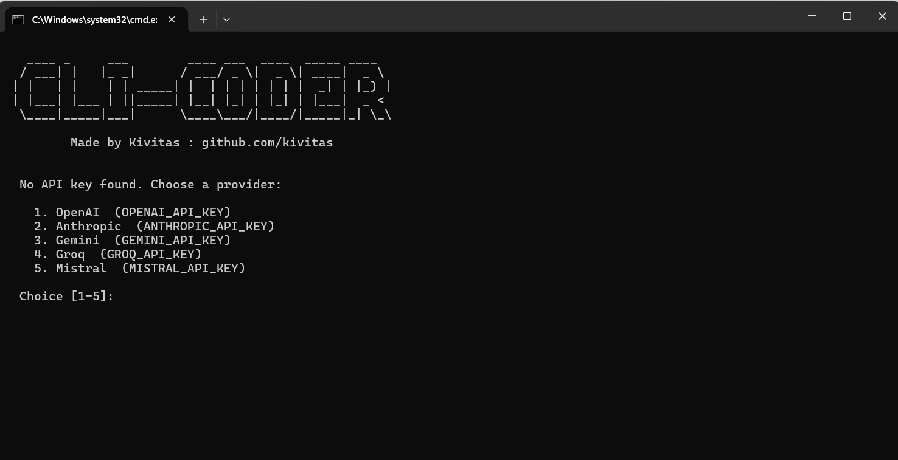

# CLI CODER

A lightweight, zero-setup terminal AI assistant and coding agent for Windows.

CLI CODER provides a conversational interface powered by LiteLLM, plus a full coding agent (`mini-swe-agent`) that can write code, run terminal commands, and solve tasks autonomously directly in your workspace.

## Features

- **Zero Setup**: Build the launcher once (see [INSTALLATION.md](INSTALLATION.md)). It automatically downloads `uv`, creates a Python environment, installs dependencies, and patches Windows-specific bugs.
- **Any Provider**: Built-in support for OpenAI, Anthropic, Gemini, Groq, and Mistral.
- **Streaming Chat**: Fast, real-time responses directly in your terminal.
- **Coding Agent**: Use `/code <task>` as a universal tool. If you ask it to `analyse`, `explain`, or `summarize`, it uses a lightning-fast read path to instantly give you a summary without hitting API limits. If you ask it to fix a bug or add a feature, it unleashes an autonomous SWE agent that can edit files, run commands, and solve complex problems.
- **Context Aware**: The agent reads your recent chat history and tracks file changes before and after it runs, providing a clean summary of what it modified.
- **Workspace Tools**: Read files (`/read`), list directories (`/ls`, `/tree`), and execute shell commands (`/run`) directly from chat. Include `/analyze` to manually trigger a one-shot project summary.

## Installation

1. Clone or download this repository.
2. Read [INSTALLATION.md](INSTALLATION.md) for a 3-step guide on how to build your local `.cmd` launcher.
3. Once built, double-click your new `cli_coder.cmd` to set up everything and launch the assistant.

## Usage

Type naturally to chat with the AI. Use slash commands for advanced features:

### Slash Commands

| Command | Description |
|---------|-------------|
| `/code <task>` | Smart coding assistant (fast-path for analysis, autonomous agent for bugs) |
| `/run <cmd>` | Run a shell command (output is fed to AI) |
| `/ls [pattern]`| List files (supports glob, e.g., `/ls *.py`) |
| `/read <file>` | Read file contents into chat context |
| `/tree` | Show directory structure |
| `/analyze` | Summarize the project quickly |
| `/cwd <path>` | Change working directory |
| `/system <msg>`| Set a custom system prompt |
| `/history` | Show conversation log |
| `/save` | Export chat to a `.md` file |
| `/clear` | Clear chat history |
| `/model <name>`| Change AI model (e.g., `gemini/gemini-1.5-pro`) |
| `/key` | Switch provider / API key |
| `/info` | Show current settings, CWD, and token usage |
| `/reset` | Wipe config and start fresh |

## Architecture

CLI CODER uses a dual-mode architecture. For full technical details on how the ReAct agent routing and Windows-specific patch system works, please see [ARCHITECTURE.md](ARCHITECTURE.md).

## License

MIT License. See [LICENSE](LICENSE) for details. Made by Kivitas.
